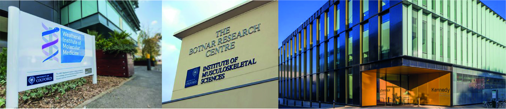

<link href="static/css/bootstrap.css" rel="stylesheet" media="screen">
<link href="static/css/bootstrap-responsive.min.css" rel="stylesheet">
<link href="static/css/bootstrap-social.css" rel="stylesheet">
<link href="static/css/font-awesome.css" rel="stylesheet" >
<link href="static/css/custom.css" rel="stylesheet" >

<h2 style="text-align:center;font-family:Helvetica; font-color:black;">About me</h2> 

{width=100%}

I began my scientific career at the Kennedy Institute of Rheumatology where I undertook a PhD investigating why regulatory T cells (Treg) were defective in Rheumatoid arthritis (RA). I identified that DNA methylation at the CTLA-4 promoter led to impaired Treg function that contributes to the inflammatory processes in RA.

Following my PhD I moved to [Prof Sir Marc Feldmann](https://en.wikipedia.org/wiki/Marc_Feldmann) and [Prof Udo Opperman's](https://www.ndorms.ox.ac.uk/team/udo-oppermann) laboratory at the Botnar research centre to investigate epigenetic pathways that are important for T and NK cell activation. During this time I was using a number of whole genome wide techniques to analyse the contribution of histone marks to autoimmunity.

Despite developing extensive knowledge of experimental design and state-of-the art laboratory techniques, at the time I was unable to analyse the resulting data to a high standard, which motivated me to apply for my current MRC fellowship in computational biology based at the Weatherall Institute of Molecular Medicine (University of Oxford). During this time I developed a number of core computational, mathematical and statistical skills that now allow me to write complex code, enabling the difficult analysis and interpretation of next-generation sequencing data.

Since 2018, I have been appointed group leader in systems biology at the Botnar Research Centre, where I lead a number of computational projects, some of which are highlighted [here](). 

