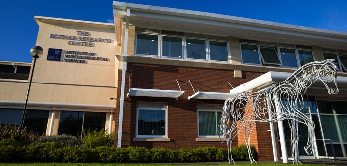

<link href="static/css/custom.css" rel="stylesheet" >

<h2 style="text-align:center;font-family:Helvetica; font-color:black;">Current place of work</h2> 

<b>The Botnar Research Centre (University of Oxford):</b>  
	<a class="external-link" target="MRC Centre for Computational Biology" href="https://www.ndorms.ox.ac.uk/about/botnar-research-centre">The Botnar Research Centre</a> 
	University of Oxford 
	Nuffield department of Orthopaedics 
	Windmill Road 
	OXFORD 
	OX3 7LD 

<h1>Where to find the Botnar</h1>

<html>
  <head>
    
  </head>
  <body>
    <!--The div element for the map -->
    

    
    <!--Load the API from the specified URL
    * The async attribute allows the browser to render the page while the API loads
    * The key parameter will contain your own API key (which is not needed for this tutorial)
    * The callback parameter executes the initMap() function
    -->
    
  </body>
</html>